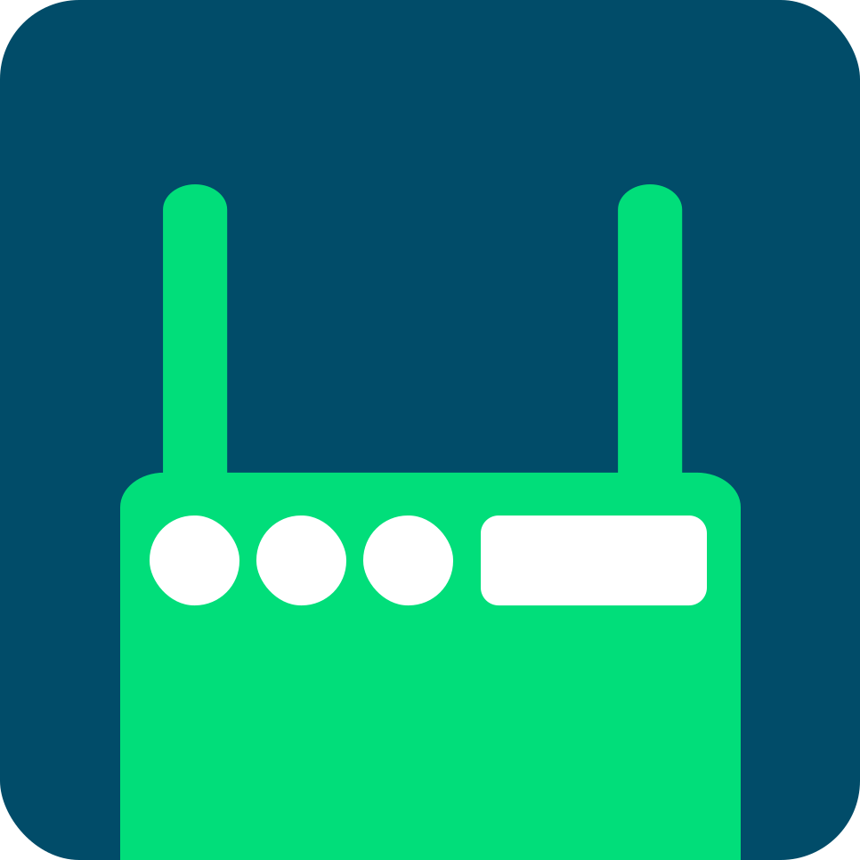

<h2><b>PortMapper</b></h2>
<h4>A free open source UPnP Port Forwarding tool developed using Kotlin and Jetpack Compose</h4>

---

### Features

* Add port forwarding rules (including ranges)
* View all current UPnP port forwarding rules
* Delete, Enable/Disable rules
* Easily view logs and diagnostics
* Day/Night Theme
